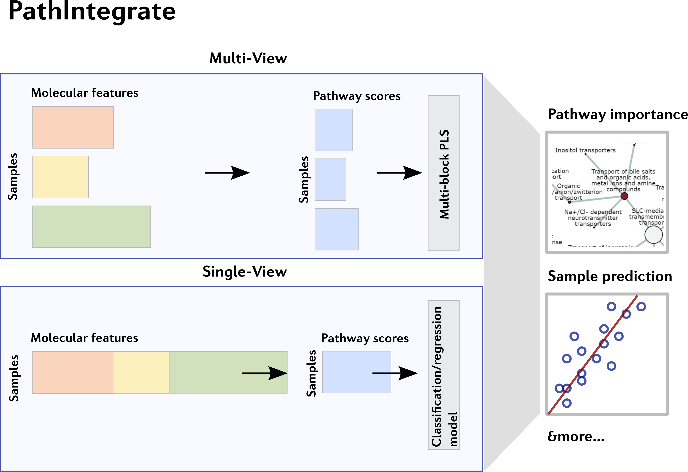

# PathIntegrate
PathIntegrate Python package for pathway-based multi-omics data integration



## Features

## Installation
```
pip install pathintegrate
```

## Tutorials and documentation
Please see our Quickstart guide on Google Colab

Full documentation and function reference for PathIntegrate can be found via our ReadTheDocs page