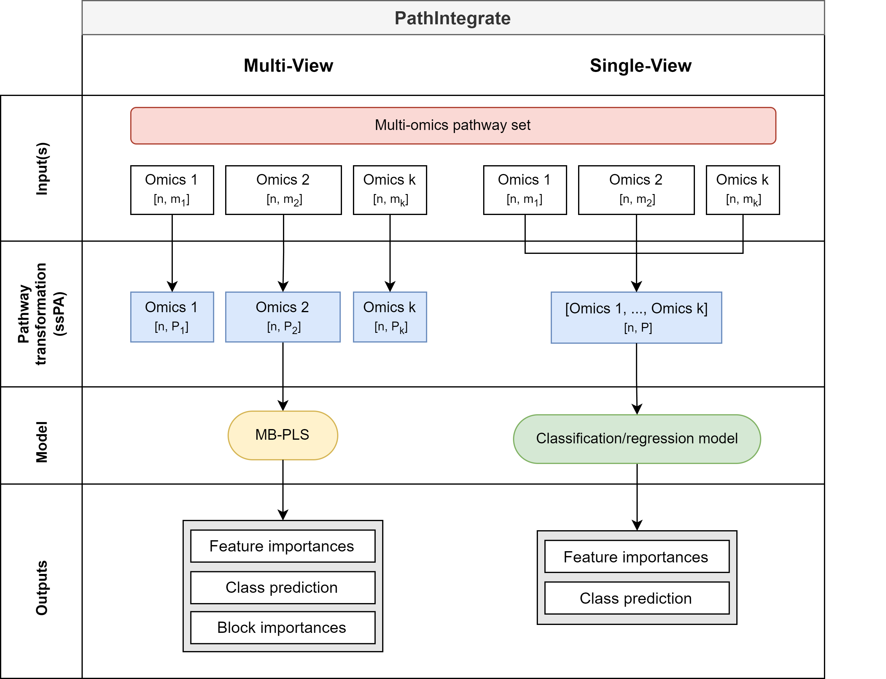

# PathIntegrate
PathIntegrate Python package for pathway-based multi-omics data integration



#### Abstract
>As terabytes of multi-omics data are being generated, there is an ever-increasing need for methods facilitating the integration and interpretation of such data. Current multi-omics integration methods typically output lists, clusters, or subnetworks of molecules related to an outcome. Even with expert domain knowledge, discerning the biological processes involved is a time-consuming activity. Here we propose PathIntegrate, a method for integrating multi-omics datasets based on pathways, designed to exploit knowledge of biological systems and thus provide interpretable models for such studies. PathIntegrate employs single-sample pathway analysis to transform multi-omics datasets from the molecular to the pathway-level, and applies a predictive single-view or multi-view model to integrate the data. Model outputs include multi-omics pathways ranked by their contribution to the outcome prediction, the contribution of each omics layer, and the importance of each molecule in a pathway. 

## Features
- Pathway-based multi-omics data integration using PathIntegrate Multi-View and Single-View models
    - Multi-View model: Integrates multiple omics datasets using a shared pathway-based latent space
    - Single-View model: Integrates multi-omics data into one set of multi-omics pathway scores and applies an SKlearn-compatible predictive model
    - Pathway importance
    - Sample prediction
- SKlearn-like API for easy integration into existing pipelines
- Support for multiple pathway databases, including KEGG and Reactome
- Support for multiple pathway scoring methods available via the [sspa](https://github.com/cwieder/py-ssPA) package
- Cytoscape Network Viewer app for visualizing pathway-based multi-omics data integration results


## System requirements
### Hardware
At least 8BG RAM recommended. PathIntegrate models can run on a Google Colab notebook server (see walkthrough tutorial below with example data).

### Software
PathIntegrate has been tested on MacOs, Windows 10 and Linux. Python 3.10 or higher is required. Python dependencies are listed in the requirements.txt file.

## Installation
```bash
pip install PathIntegrate
```

## Tutorials and documentation
Please see our Quickstart guide on [Google Colab](https://colab.research.google.com/drive/1nv9lp8mMQ2Yk8n9uI9hBMvH71MlWp3UJ?usp=sharing)

Full documentation and function reference for PathIntegrate can be found via our [ReadTheDocs page](https://cwieder.github.io/PathIntegrate/)

## Citing PathIntegrate
If you use PathIntegrate in your research, please consider citing our paper:
```bibtex
PathIntegrate: Multivariate modelling approaches for pathway-based multi-omics data integration

Cecilia Wieder, Juliette Cooke, Clement Frainay, Nathalie Poupin, Jacob G. Bundy, Russell Bowler, Fabien Jourdan, Katerina J. Kechris, Rachel PJ Lai, Timothy Ebbels

Manuscript in preparation
```

## License
GNU GPL v3