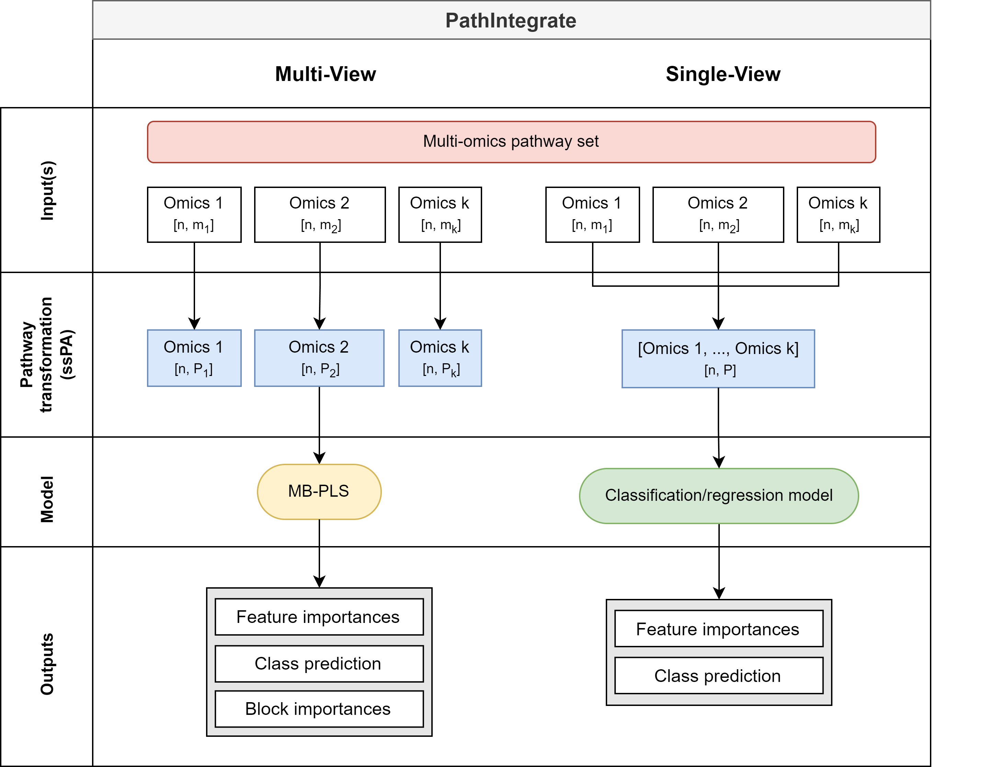

# PathIntegrate
PathIntegrate Python package for pathway-based multi-omics data integration



## Features
- Pathway-based multi-omics data integration using PathIntegrate Multi-View and Single-View models
    - Multi-View model: Integrates multiple omics datasets using a shared pathway-based latent space
    - Single-View model: Integrates multi-omics data into one set of multi-omics pathway scores and applies an SKlearn-compatible predictive model
    - Pathway importance
    - Sample prediction
- SKlearn-like API for easy integration into existing pipelines
- Support for multiple pathway databases, including KEGG and Reactome
- Support for multiple pathway scoring methods available via the [sspa](https://github.com/cwieder/py-ssPA) package
- Cytoscape Network Viewer app for visualizing pathway-based multi-omics data integration results


## Installation
```bash
pip install -i https://test.pypi.org/simple/ PathIntegrate
```

## Tutorials and documentation
Please see our Quickstart guide on [Google Colab](https://colab.research.google.com/drive/1nv9lp8mMQ2Yk8n9uI9hBMvH71MlWp3UJ?usp=sharing)


## Citing PathIntegrate
If you use PathIntegrate in your research, please cite our paper:
```bibtex
PathIntegrate: Multivariate modelling approaches for pathway-based multi-omics data integration

Cecilia Wieder, Juliette Cooke, Clement Frainay, Nathalie Poupin, Jacob G. Bundy, Russell Bowler, Fabien Jourdan, Katerina J. Kechris, Rachel PJ Lai, Timothy Ebbels

Manuscript in preparation
```